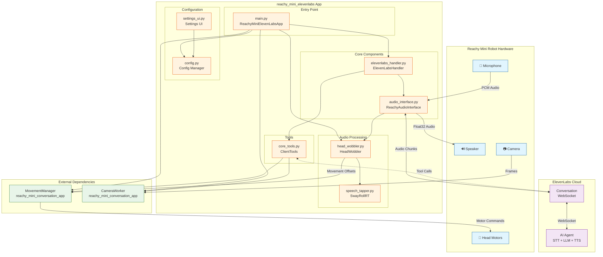
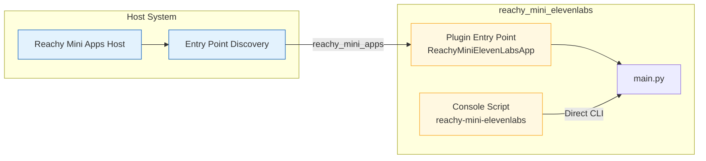
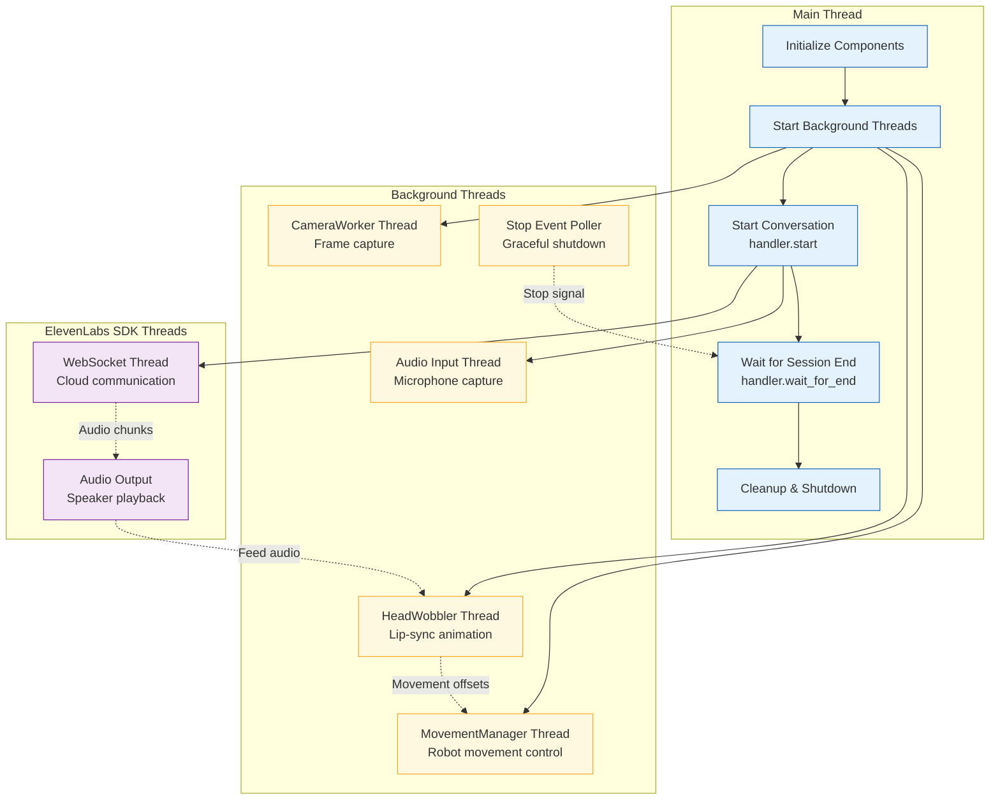
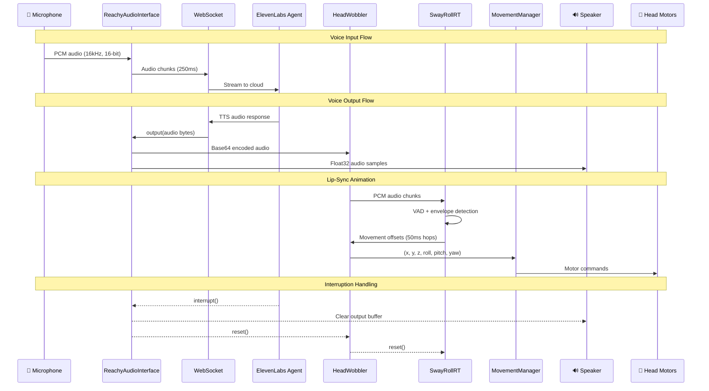
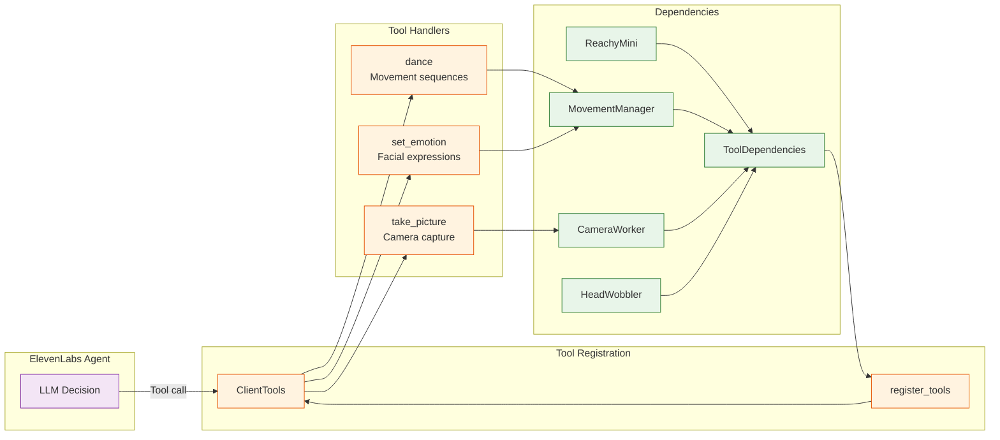
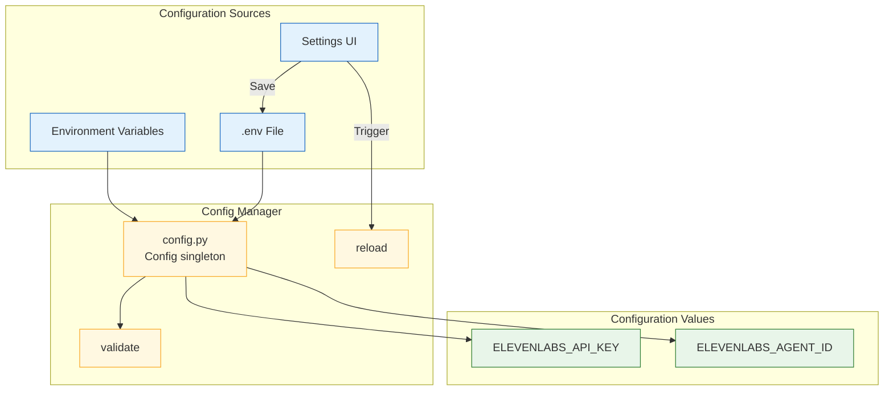
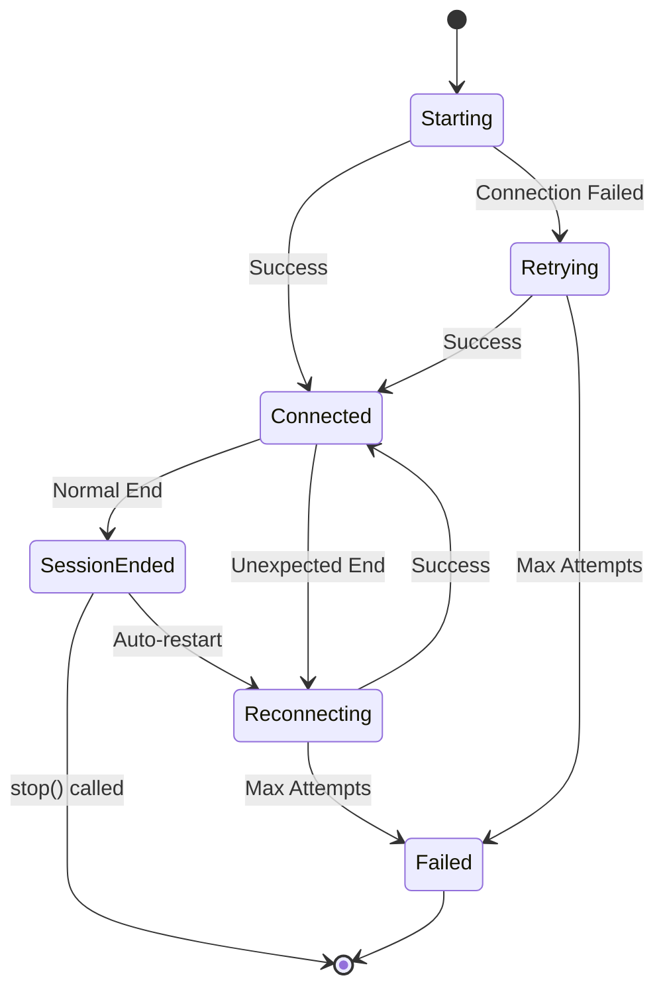
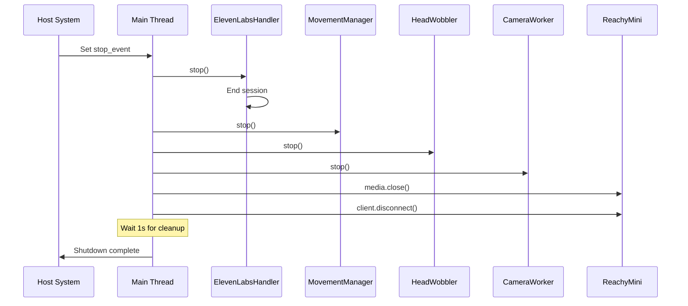

# Architecture Documentation

This document describes the runtime architecture, host integration, threading model, and dataflow for the `reachy_mini_elevenlabs` package.

## Overview

`reachy_mini_elevenlabs` is a Reachy Mini app that integrates ElevenLabs Conversational AI for interactive voice conversations. The architecture bridges the ElevenLabs SDK with the robot's hardware through a custom `ReachyAudioInterface`, enabling:

1. **Voice Input**: Capture audio from the robot's microphone and stream to ElevenLabs
2. **Voice Output**: Play synthesized speech through the robot's speaker
3. **Lip-Sync Animation**: Convert audio to head movements for natural interaction
4. **Agent Tools**: Allow the AI agent to control robot actions (camera, dance, emotions)

## System Architecture



## Host Integration

The app integrates with the Reachy Mini host system through two entry points:

### Entry Points



### ReachyMiniElevenLabsApp Class

The `ReachyMiniElevenLabsApp` class extends `ReachyMiniApp` to integrate with the host:

```python
class ReachyMiniElevenLabsApp(ReachyMiniApp):
    custom_app_url = "http://0.0.0.0:7860/"  # Settings UI URL
    dont_start_webserver = False              # Enable settings server
    
    def run(self, reachy_mini: ReachyMini, stop_event: threading.Event) -> None:
        # Host provides robot instance and stop signal
        # App delegates to main run() function
```

### Host Integration Flow

1. **Discovery**: Host discovers app via `reachy_mini_apps` entry point in `pyproject.toml`
2. **Initialization**: Host creates `ReachyMiniElevenLabsApp` instance
3. **Launch**: Host calls `run()` with robot instance and stop event
4. **Settings UI**: Host mounts settings routes on its FastAPI server
5. **Shutdown**: Host sets stop event, app performs graceful cleanup

## Threading Model

The app uses multiple threads for concurrent operations:



### Thread Responsibilities

| Thread | Module | Purpose |
|--------|--------|---------|
| Main | `main.py` | Initialization, conversation lifecycle, cleanup |
| MovementManager | `reachy_mini_conversation_app` | Executes robot movements, applies speech offsets |
| HeadWobbler | `head_wobbler.py` | Converts audio to head movement offsets |
| CameraWorker | `reachy_mini_conversation_app` | Captures camera frames for agent tools |
| Audio Input | `audio_interface.py` | Reads microphone, sends to ElevenLabs |
| Stop Poller | `main.py` | Monitors host stop event for graceful shutdown |
| WebSocket | ElevenLabs SDK | Manages cloud communication |

### Thread Synchronization

The app uses several synchronization mechanisms:

1. **HeadWobbler Generation Counter**: Prevents stale audio from affecting movements after interruption
2. **State Locks**: Protect shared state in HeadWobbler (`_state_lock`, `_sway_lock`)
3. **Stop Events**: `threading.Event` for coordinated shutdown
4. **Queue**: Thread-safe audio queue between audio interface and HeadWobbler

## Audio Dataflow

The audio pipeline handles bidirectional audio streaming:



### Audio Format Specifications

| Stage | Format | Sample Rate | Notes |
|-------|--------|-------------|-------|
| Microphone Input | 16-bit PCM mono | 16 kHz | Robot hardware format |
| ElevenLabs Input | 16-bit PCM mono | 16 kHz | 250ms chunks (4000 samples) |
| ElevenLabs Output | 16-bit PCM mono | 16 kHz | Variable chunk sizes |
| Speaker Output | Float32 mono | 16 kHz | Converted from int16 |
| HeadWobbler Input | 16-bit PCM mono | 24 kHz | Resampled internally |
| SwayRollRT Output | Movement dict | 50ms hops | Per-hop sway values |

### Lip-Sync Animation Pipeline

The `SwayRollRT` class converts audio to natural head movements:

1. **Preprocessing**: Convert input to float32 mono, resample to 16kHz
2. **VAD (Voice Activity Detection)**: Detect speech using RMS dB thresholds
   - Attack: 40ms above -35 dB to activate
   - Release: 250ms below -45 dB to deactivate
3. **Envelope Following**: Smooth transitions with attack/release curves
4. **Loudness Mapping**: Map dB to [0,1] with gamma correction
5. **Oscillator Generation**: Generate sinusoidal movements for each axis:
   - Pitch: 2.2 Hz, ±4.5°
   - Yaw: 0.6 Hz, ±7.5°
   - Roll: 1.3 Hz, ±2.25°
   - X/Y/Z translation: 0.25-0.45 Hz, ±2.25-4.5mm

## Tool System

The agent can invoke tools to control the robot:



### Available Tools

| Tool | Description | Parameters |
|------|-------------|------------|
| `take_picture` | Capture image from robot camera | None |
| `dance` | Execute predefined dance sequence | `dance_name: str` |
| `set_emotion` | Set robot facial expression | `emotion: str` |

## Configuration System

Configuration is managed through environment variables and the settings UI:



### Required Configuration

| Variable | Required | Description |
|----------|----------|-------------|
| `ELEVENLABS_AGENT_ID` | Yes | The ElevenLabs agent ID to connect to |
| `ELEVENLABS_API_KEY` | No* | API key for private agents |

*API key is required only for private agents; public agents can be accessed without authentication.

## Error Handling & Reconnection

The handler implements robust error handling with exponential backoff:



### Reconnection Parameters

| Parameter | Default | Description |
|-----------|---------|-------------|
| `max_reconnect_attempts` | 5 | Maximum retry attempts |
| `initial_backoff` | 1.0s | Initial wait time |
| `max_backoff` | 30.0s | Maximum wait time |
| `backoff_multiplier` | 2.0 | Exponential multiplier |

## Shutdown Sequence

Graceful shutdown ensures all resources are properly released:



## File Structure

```
src/reachy_mini_elevenlabs/
├── __init__.py              # Package exports
├── main.py                  # Entry point, ReachyMiniElevenLabsApp
├── config.py                # Configuration management
├── elevenlabs_handler.py    # Conversation lifecycle
├── audio_interface.py       # ReachyAudioInterface
├── settings_ui.py           # FastAPI settings routes
├── utils.py                 # Logging, argument parsing
├── audio/
│   ├── __init__.py
│   ├── head_wobbler.py      # HeadWobbler thread
│   ├── speech_tapper.py     # SwayRollRT audio analysis
│   └── utils.py             # Audio format conversion
├── tools/
│   ├── __init__.py
│   └── core_tools.py        # Tool registration & handlers
└── static/
    ├── index.html           # Settings UI page
    ├── main.js              # Settings UI logic
    └── style.css            # Settings UI styles
```