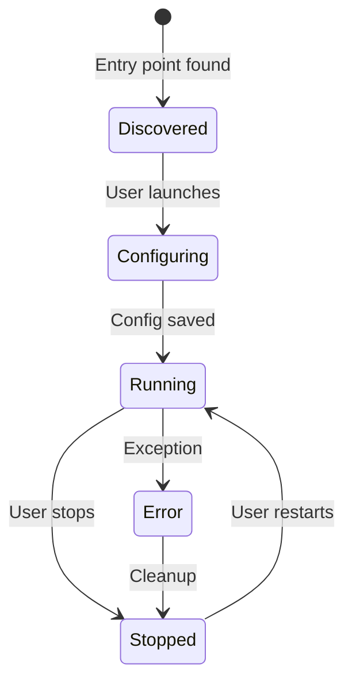

# Integration with Reachy Mini Control Host

This guide explains how to integrate the `reachy_mini_elevenlabs` app into the Reachy Mini Control host system for production deployment.

## Overview

The Reachy Mini Control host system provides:
- App discovery via Python entry points
- Unified web dashboard for app management
- Shared robot instance across apps
- Settings UI integration
- Lifecycle management (start/stop)

## Prerequisites

- Reachy Mini robot with Control host system installed
- SSH access to the robot
- Basic familiarity with Python virtual environments

## Installation Methods

### Method 1: Install from PyPI (Recommended for Production)

Once published to PyPI:

```bash
# SSH into the robot
ssh reachy@<robot-ip>

# Activate the Control host virtual environment
source ~/reachy_mini_control/venv/bin/activate

# Install the package
pip install reachy-mini-elevenlabs

# Restart the Control host
sudo systemctl restart reachy-mini-control
```

### Method 2: Install from Source (Development)

For development or testing unreleased versions:

```bash
# SSH into the robot
ssh reachy@<robot-ip>

# Clone the repository
cd ~
git clone https://github.com/your-org/reachy_mini_elevenlabs.git

# Activate the Control host virtual environment
source ~/reachy_mini_control/venv/bin/activate

# Install in editable mode
cd reachy_mini_elevenlabs
pip install -e .

# Restart the Control host
sudo systemctl restart reachy-mini-control
```

### Method 3: Install from Wheel

For offline installation or specific versions:

```bash
# Build wheel on development machine
cd reachy_mini_elevenlabs
pip install build
python -m build

# Copy wheel to robot
scp dist/reachy_mini_elevenlabs-*.whl reachy@<robot-ip>:~

# SSH into robot and install
ssh reachy@<robot-ip>
source ~/reachy_mini_control/venv/bin/activate
pip install ~/reachy_mini_elevenlabs-*.whl

# Restart the Control host
sudo systemctl restart reachy-mini-control
```

## Entry Point Discovery

The host discovers apps through the `reachy_mini_apps` entry point group defined in `pyproject.toml`:

```toml
[project.entry-points.reachy_mini_apps]
elevenlabs = "reachy_mini_elevenlabs.main:ReachyMiniElevenLabsApp"
```

### How Discovery Works

1. **Host Startup**: Control host scans for `reachy_mini_apps` entry points
2. **App Registration**: Each entry point is registered as an available app
3. **Dashboard Display**: App appears in the web dashboard
4. **User Launch**: User clicks app in dashboard
5. **App Instantiation**: Host creates `ReachyMiniElevenLabsApp` instance
6. **App Execution**: Host calls `run()` method with robot instance

### Verification

Check if the app is discovered:

```bash
# List all installed entry points
python -c "from importlib.metadata import entry_points; print([ep.name for ep in entry_points(group='reachy_mini_apps')])"
```

Expected output should include `elevenlabs`.

## Configuration

### Instance-Specific Configuration

Each app instance gets its own configuration directory:

```
~/reachy_mini_control/instances/<app-name>-<instance-id>/
├── .env              # Instance-specific environment variables
└── config.json       # Instance metadata
```

### Setting Configuration via Settings UI

1. **Access Dashboard**: Navigate to `http://<robot-ip>:8000`
2. **Launch App**: Click on "ElevenLabs Conversation" app
3. **Settings Page**: App redirects to settings page if not configured
4. **Enter Credentials**:
   - ElevenLabs Agent ID (required)
   - ElevenLabs API Key (optional for public agents)
5. **Save**: Configuration is persisted to instance `.env` file
6. **Auto-Start**: App automatically starts after configuration

### Manual Configuration

Alternatively, configure manually via SSH:

```bash
# SSH into robot
ssh reachy@<robot-ip>

# Find instance directory
cd ~/reachy_mini_control/instances
ls -la  # Look for elevenlabs-* directory

# Edit .env file
cd elevenlabs-<instance-id>
nano .env
```

Add configuration:

```env
ELEVENLABS_AGENT_ID=your_agent_id_here
ELEVENLABS_API_KEY=your_api_key_here  # Optional for public agents
```

## Settings UI Integration

### How Settings UI Works

The app provides a FastAPI-based settings UI that integrates with the host:

```python
class ReachyMiniElevenLabsApp(ReachyMiniApp):
    custom_app_url = "http://0.0.0.0:7860/"  # Settings UI URL
    dont_start_webserver = False              # Enable settings server
```

### Settings Routes

The host mounts these routes on its FastAPI server:

| Route | Method | Purpose |
|-------|--------|---------|
| `/status` | GET | Check if configuration is complete |
| `/elevenlabs_config` | POST | Save ElevenLabs credentials |
| `/static/*` | GET | Serve settings UI assets |

### Customizing Settings UI

To customize the settings UI, edit files in `src/reachy_mini_elevenlabs/static/`:

- `index.html`: Page structure
- `style.css`: Styling
- `main.js`: Client-side logic

## Lifecycle Management

### App States



### Starting the App

**Via Dashboard:**
1. Navigate to `http://<robot-ip>:8000`
2. Click "ElevenLabs Conversation" card
3. Configure if needed
4. App starts automatically

**Via API:**
```bash
curl -X POST http://<robot-ip>:8000/api/apps/elevenlabs/start
```

### Stopping the App

**Via Dashboard:**
1. Click "Stop" button on app card

**Via API:**
```bash
curl -X POST http://<robot-ip>:8000/api/apps/elevenlabs/stop
```

**Via SSH:**
```bash
# Restart entire host (stops all apps)
sudo systemctl restart reachy-mini-control
```

### Graceful Shutdown

The app handles shutdown gracefully:

1. Host sets `stop_event`
2. App detects event in poller thread
3. ElevenLabs session ends
4. Background threads stop
5. Robot resources released
6. App exits cleanly

## Shared Resources

### Robot Instance

The host provides a shared `ReachyMini` instance:

```python
def run(self, reachy_mini: ReachyMini, stop_event: threading.Event) -> None:
    # Use provided robot instance
    # Don't create new connection
```

**Important**: Don't call `reachy_mini.disconnect()` - the host manages the connection.

### Stop Event

Monitor the stop event for graceful shutdown:

```python
def poll_stop_event() -> None:
    if app_stop_event is not None:
        app_stop_event.wait()  # Blocks until stop requested
    # Cleanup...
```

### Settings App

The host provides a FastAPI app for settings routes:

```python
def run(self, reachy_mini: ReachyMini, stop_event: threading.Event) -> None:
    # Access via self.settings_app
    if self.settings_app is not None:
        mount_settings_routes(self.settings_app, instance_path)
```

## Troubleshooting

### App Not Appearing in Dashboard

**Symptoms**: App doesn't show up in the web dashboard

**Solutions**:
1. Verify installation: `pip list | grep reachy-mini-elevenlabs`
2. Check entry points: `python -c "from importlib.metadata import entry_points; print(list(entry_points(group='reachy_mini_apps')))"`
3. Restart host: `sudo systemctl restart reachy-mini-control`
4. Check host logs: `sudo journalctl -u reachy-mini-control -f`

### Configuration Not Persisting

**Symptoms**: Settings reset after app restart

**Solutions**:
1. Check instance directory exists: `ls ~/reachy_mini_control/instances/`
2. Verify `.env` file permissions: `ls -la ~/reachy_mini_control/instances/elevenlabs-*/`
3. Check for write errors in logs
4. Ensure disk space available: `df -h`

### App Crashes on Start

**Symptoms**: App starts but immediately stops

**Solutions**:
1. Check logs: `sudo journalctl -u reachy-mini-control -f`
2. Verify dependencies: `pip check`
3. Test standalone: `reachy-mini-elevenlabs --debug`
4. Check robot connection: `ping <robot-ip>`

### Settings UI Not Loading

**Symptoms**: Settings page shows 404 or blank

**Solutions**:
1. Verify static files installed: `python -c "import reachy_mini_elevenlabs; print(reachy_mini_elevenlabs.__file__)"`
2. Check static directory: `ls <package-path>/static/`
3. Verify `dont_start_webserver = False` in app class
4. Check browser console for errors

### WebSocket Connection Fails

**Symptoms**: "WebSocket connection failure" in logs

**Solutions**:
1. Check internet connectivity from robot: `ping 8.8.8.8`
2. Verify firewall rules: `sudo ufw status`
3. Test DNS resolution: `nslookup api.elevenlabs.io`
4. Check API key validity
5. Verify agent ID is correct

## Monitoring and Logs

### Viewing Logs

**Real-time logs:**
```bash
sudo journalctl -u reachy-mini-control -f
```

**Recent logs:**
```bash
sudo journalctl -u reachy-mini-control -n 100
```

**Filter by app:**
```bash
sudo journalctl -u reachy-mini-control | grep -i elevenlabs
```

### Log Levels

The app uses Python's logging module:

- `DEBUG`: Detailed diagnostic information
- `INFO`: General informational messages
- `WARNING`: Warning messages (non-critical issues)
- `ERROR`: Error messages (critical issues)

### Health Monitoring

Monitor app health via the dashboard or API:

```bash
# Check app status
curl http://<robot-ip>:8000/api/apps/elevenlabs/status

# Expected response
{
  "status": "running",
  "uptime": 3600,
  "conversation_id": "conv_abc123"
}
```

## Updating the App

### Update from PyPI

```bash
ssh reachy@<robot-ip>
source ~/reachy_mini_control/venv/bin/activate
pip install --upgrade reachy-mini-elevenlabs
sudo systemctl restart reachy-mini-control
```

### Update from Source

```bash
ssh reachy@<robot-ip>
cd ~/reachy_mini_elevenlabs
git pull
source ~/reachy_mini_control/venv/bin/activate
pip install -e .
sudo systemctl restart reachy-mini-control
```

### Rollback to Previous Version

```bash
ssh reachy@<robot-ip>
source ~/reachy_mini_control/venv/bin/activate
pip install reachy-mini-elevenlabs==<previous-version>
sudo systemctl restart reachy-mini-control
```

## Uninstallation

### Remove App

```bash
ssh reachy@<robot-ip>
source ~/reachy_mini_control/venv/bin/activate
pip uninstall reachy-mini-elevenlabs
sudo systemctl restart reachy-mini-control
```

### Clean Up Instance Data

```bash
# Remove instance directories
rm -rf ~/reachy_mini_control/instances/elevenlabs-*
```

## Best Practices

1. **Version Pinning**: Pin specific versions in production
2. **Configuration Backup**: Backup `.env` files before updates
3. **Testing**: Test updates in development before production
4. **Monitoring**: Monitor logs after deployment
5. **Graceful Shutdown**: Always stop apps before host restart
6. **Resource Cleanup**: Ensure proper cleanup in `run()` method
7. **Error Handling**: Handle all exceptions gracefully
8. **Documentation**: Keep configuration documented

## Security Considerations

1. **API Keys**: Store API keys in `.env` files, never in code
2. **File Permissions**: Ensure `.env` files have restricted permissions (600)
3. **Network Security**: Use firewall rules to restrict access
4. **Updates**: Keep dependencies updated for security patches
5. **Logging**: Don't log sensitive information (API keys, etc.)

## Support

For issues specific to:
- **Host Integration**: Contact Reachy Mini Control support
- **App Functionality**: Open issue on GitHub repository
- **ElevenLabs API**: Contact ElevenLabs support

## Next Steps

- See [RUN_LOCAL.md](RUN_LOCAL.md) for local development
- See [ARCHITECTURE.md](ARCHITECTURE.md) for system design
- See [REPO_MAP.md](REPO_MAP.md) for codebase navigation
