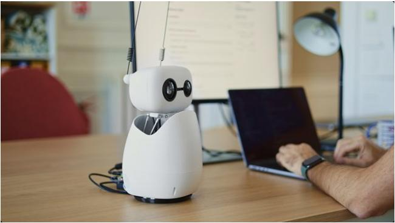
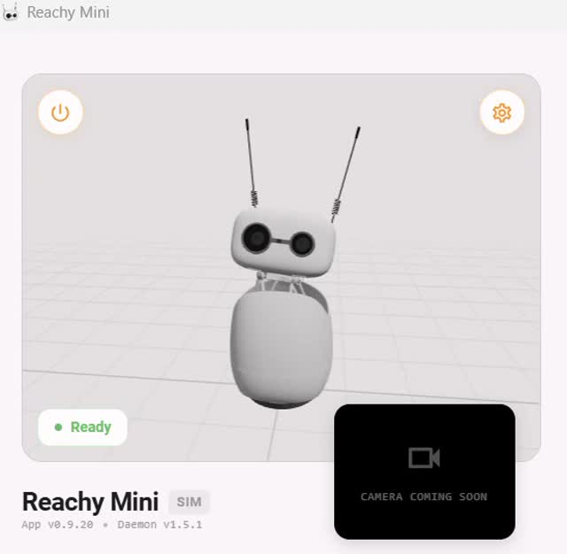
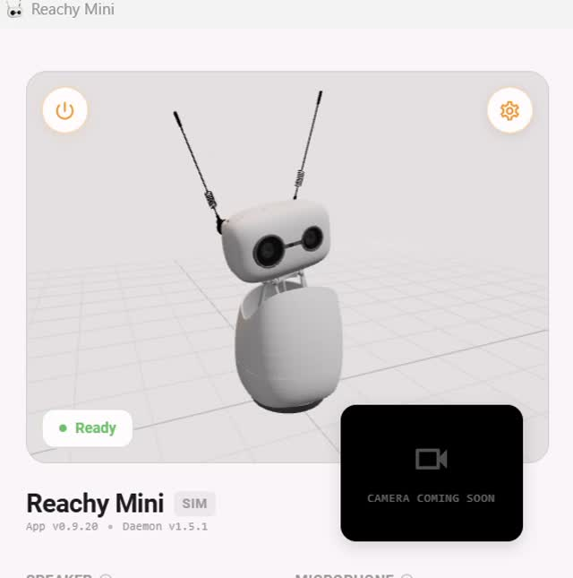
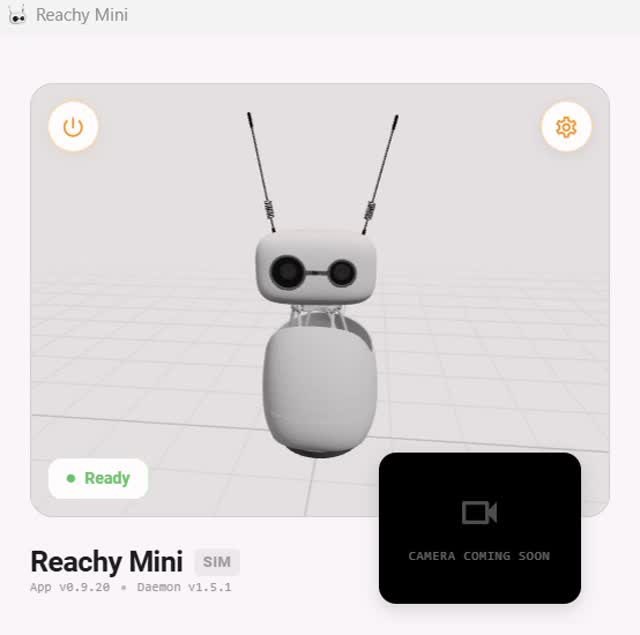
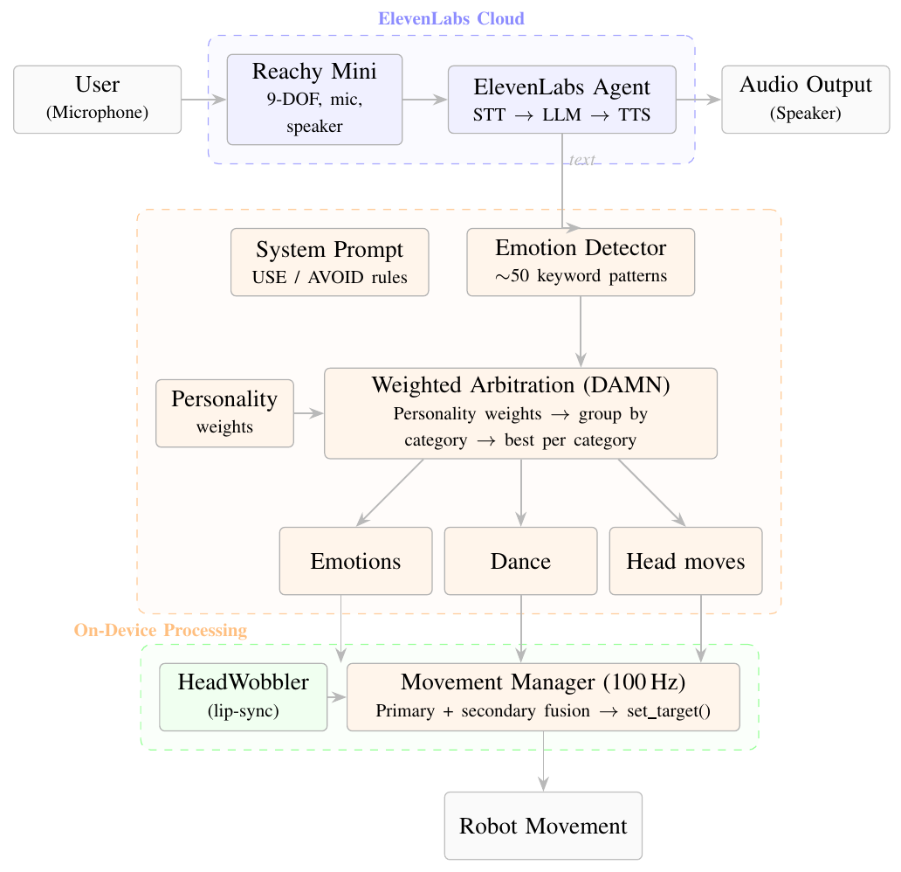
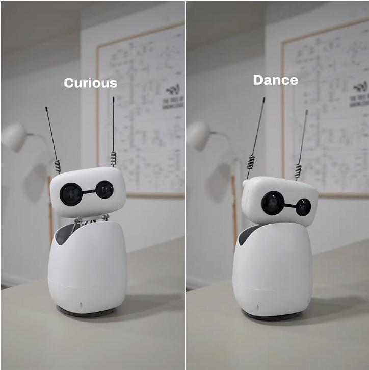
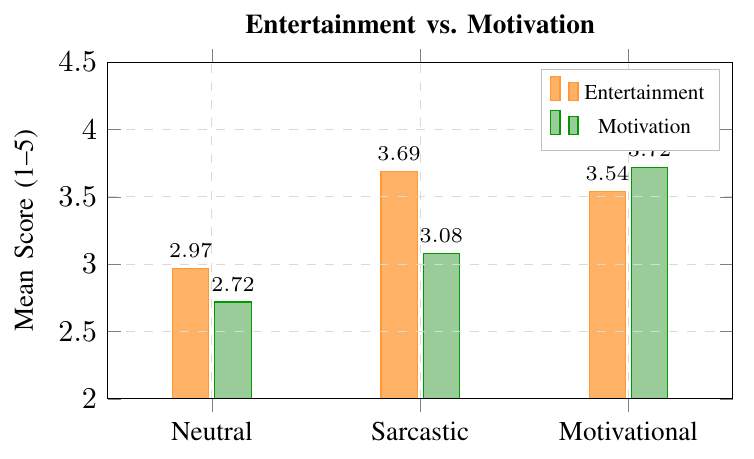

# Reachy Mini Accountability Coach

**By [mindmodel.ai](https://mindmodel.ai) & [ageai.io](https://ageai.io)**

Transform your Reachy Mini into an intelligent conversational companion using ElevenLabs' advanced Conversational AI platform.

> Open source project from the teams at mindmodel.ai and ageai.io - building the future of AI-powered robotics.

<p align="center">
  
</p>

*Reachy Mini in the study's desk-based interaction setting (project report, Figure 1).*

## Features

- **Natural Voice Conversations** - Speak naturally with your robot using ElevenLabs' state-of-the-art speech recognition
- **Expressive Speech Synthesis** - High-quality, natural-sounding voice responses
- **Emotion Detection** - Automatic emotion detection from agent responses triggers expressive robot movements
- **Animated Responses** - Synchronized head movements and lip-sync animations during conversation
- **Easy Configuration** - Simple web-based settings interface for agent setup
- **One-Click Install** - Install directly from the Reachy Mini Control app

## Demo

### Featured: Sarcastic Megatron

Watch Reachy Mini deliver accountability coaching with sarcasm, dry humor, and expressive robot movements.

[](https://youtu.be/3ASY7u5G7-U)

**[Watch the sarcastic coach demo on YouTube](https://youtu.be/3ASY7u5G7-U)**

### Compare the Three Coaching Styles

| Sarcastic (Megatron) | Motivational | Neutral |
| --- | --- | --- |
| [](https://youtu.be/3ASY7u5G7-U) | [](https://youtu.be/Hil7GkhlX34) | [](https://youtu.be/jJTMjFDXErQ) |

*Frames from the supplied demo recordings, shown in the Reachy Mini simulator. Click an image to watch that coaching style.*


| Coaching style | Demo |
| --- | --- |
| **Sarcastic (Megatron)** | [Watch demo](https://youtu.be/3ASY7u5G7-U) |
| **Motivational** | [Watch demo](https://youtu.be/Hil7GkhlX34) |
| **Neutral** | [Watch demo](https://youtu.be/jJTMjFDXErQ) |

## Project Report

This ECE 787 Social Robotics project at the University of Waterloo compares verbal and non-verbal communication styles in an LLM-powered accountability robot. The three coaching personalities combine ElevenLabs conversational agents with personality-specific weighted arbitration of the robot's expressive behaviors.

**[Read the full project report (PDF)](docs/ECE787_Project_Report_Omar_Ankit.pdf)**  
*Comparing Verbal and Non-Verbal Communication Styles in an LLM-Powered Accountability Robot* — Omar Ankit.

The report includes the implementation, a video-based user study with 39 participants, results, and appendices. The motivational coach received the highest likability ratings, while the sarcastic coach received the highest entertainment ratings.

### System Architecture



*Figure 3 from the report: ElevenLabs handles speech recognition, response generation, and speech synthesis. The on-device emotion detector and personality-weighted arbitration select behaviors, which the movement manager combines with audio-reactive motion.*

### Expressive Robot Poses

<p align="center">
  
</p>

*Figure 4 from the report: “Curious” (left) and “Dance” (right), illustrating the robot's non-verbal behavior.*

### Study Results



*Figure 6 from the report: mean ratings on a 1–5 scale in the video-based study (N = 39). Sarcastic coaching scored highest on entertainment (3.69); motivational coaching scored highest on motivation (3.72).*

| Measure (1–5) | Neutral | Sarcastic | Motivational |
| --- | --- | --- | --- |
| Entertainment | 2.97 | **3.69** | 3.54 |
| Motivation | 2.72 | 3.08 | **3.72** |

See the [full report](docs/ECE787_Project_Report_Omar_Ankit.pdf) for statistical comparisons and study limitations. Report images are extracted from Figures 1, 3, 4, and 6; demo images are frames from the supplied recordings.

## Quick Start

### 1. Get Your ElevenLabs Agent

Before installing, you'll need an ElevenLabs Conversational AI agent:

1. **Sign up** at [ElevenLabs Reachy Mini Agents](https://try.elevenlabs.io/reachy-mini-agents)
2. **Create** a Conversational AI agent
3. **Copy** your Agent ID (starts with `agent_...`)
4. Keep your API key handy (optional for public agents)

### 2. Install the App

From the Reachy Mini Control application:
1. Navigate to the **Apps** section
2. Find **"ElevenLabs Conversation"** in the app list
3. Click **Install**
4. Wait for installation to complete

### 2. Get Your ElevenLabs Agent

You'll need an ElevenLabs Conversational AI agent:

1. Sign up at [ElevenLabs](https://try.elevenlabs.io/reachy-mini-agents)
2. Navigate to the [Conversational AI](https://try.elevenlabs.io/reachy-mini-agents) section
3. Create a new agent or use an existing one
4. Copy your **Agent ID** (starts with `agent_`)
5. (Optional) Copy your **API Key** if using a private agent

### 3. Configure the App

1. Start the **ElevenLabs Conversation** app from Reachy Mini Control
2. Open the settings page at `http://localhost:7861/`
3. Enter your **Agent ID** from [ElevenLabs](https://try.elevenlabs.io/reachy-mini-agents)
4. (Optional) Enter your **API Key** for private agents
5. Configure emotion detection settings (optional)
6. Click **Save Settings**

### 4. Start Conversing!

Once configured, the app will automatically:
- Connect to your ElevenLabs agent
- Start listening through the robot's microphone
- Respond through the robot's speaker
- Animate the robot's head during speech

Just speak naturally to your Reachy Mini and it will respond!

## Use Cases

- **Personal Assistant** - Schedule reminders, answer questions, control smart home devices
- **Educational Companion** - Interactive learning experiences for students
- **Customer Service** - Automated reception and information desk
- **Entertainment** - Storytelling, jokes, and interactive games
- **Accessibility** - Voice-controlled interface for users with mobility challenges

## Configuration Options

### Agent ID (Required)
Your ElevenLabs Conversational AI agent identifier. This determines the personality, voice, and capabilities of your robot.

### API Key (Optional)
Only required for private agents. Public agents can be used without an API key.

### Emotion Detection (Optional)
The app automatically detects emotions from the agent's responses and triggers appropriate robot expressions:
- **Happy** responses trigger happy animations
- **Sad** or apologetic responses trigger sad expressions
- **Thinking** responses make the robot look up
- **Greetings** make the robot face forward attentively

Configure emotion detection in your `.env` file:
```bash
ENABLE_EMOTION_DETECTION=true          # Enable/disable feature
EMOTION_CONFIDENCE_THRESHOLD=0.3       # Sensitivity (0.0-1.0)
EMOTION_COOLDOWN_SECONDS=3.0           # Time between actions
```

See [EMOTION_DETECTION.md](EMOTION_DETECTION.md) for detailed documentation.

## Technical Details

### Audio Processing
- **Input**: Robot microphone at 44.1kHz (stereo) - resampled to 16kHz mono
- **Output**: ElevenLabs audio at 16kHz - played through robot speaker
- **Format**: 16-bit PCM audio for optimal quality

### Animation System
- **Lip Sync**: Real-time mouth animation synchronized with speech
- **Head Movements**: Natural head wobbling during conversation
- **Interruption Handling**: Smooth transitions when user interrupts the robot

### Supported Platforms
- Windows (Reachy Mini Control app)
- Linux (Reachy Mini Control app)
- Raspberry Pi (Reachy Mini Wireless)

## Requirements

- Reachy Mini robot (Lite or Wireless version)
- Internet connection for ElevenLabs API
- ElevenLabs account with Conversational AI agent
- Microphone and speaker (built into Reachy Mini)

## Contributing

Contributions are welcome! This app is open source under the Apache 2.0 license.

**Developed by**: [mindmodel.ai](https://mindmodel.ai) & [ageai.io](https://ageai.io)

### Development Setup

```bash
# Clone the repository
git clone https://github.com/oankit/reachy-mini-accountability-coach.git
cd reachy-mini-accountability-coach

# Install in development mode
pip install -e ".[dev]"

# Run tests
pytest
```

Visit [mindmodel.ai](https://mindmodel.ai) and [ageai.io](https://ageai.io) to learn more about our AI projects.

## License

Apache License 2.0 - See [LICENSE](LICENSE) for details.

## Acknowledgments

- **[mindmodel.ai](https://mindmodel.ai)** - AI solutions and robotics innovation
- **[ageai.io](https://ageai.io)** - Advanced AI applications and research
- **Pollen Robotics** - For creating the amazing Reachy Mini platform
- **ElevenLabs** - For their powerful Conversational AI technology
- **Hugging Face** - For hosting and supporting the Reachy Mini ecosystem

## Links

- **[hf.mindmodel.ai](https://hf.mindmodel.ai)** - View this app live
- **[mindmodel.ai](https://mindmodel.ai)** - Explore our AI solutions
- **[ageai.io](https://ageai.io)** - Advanced AI research and applications
- [ElevenLabs Conversational AI](https://try.elevenlabs.io/reachy-mini-agents)
- [Reachy Mini Documentation](https://docs.pollen-robotics.com/sdk/reachy-mini/)
- [Reachy Mini Apps](https://huggingface.co/reachy-mini-apps)

## Support

- **App**: [hf.mindmodel.ai](https://hf.mindmodel.ai)
- **Website**: [mindmodel.ai](https://mindmodel.ai) | [ageai.io](https://ageai.io)
- **Issues**: Report bugs or request features on [HuggingFace Discussions](https://huggingface.co/spaces/mindmodelai/reachy-mini-elevenlabs/discussions)
- **Community**: Join the [Reachy Mini Discord](https://discord.gg/pollen-robotics)

---

**Built with love by [mindmodel.ai](https://mindmodel.ai) & [ageai.io](https://ageai.io)**

*Empowering robots with natural conversation - open source, community-driven, and built for the future.*
